# Schema Spec
## Agency
### Canonical schema specification for the full product

## 1. Purpose
This document turns the data architecture into a database-facing schema spec.

It answers:
- which tables exist in the full product
- what each table is for
- which key relationships matter
- which status models and enums the app depends on

This is the canonical schema definition document for product and engineering planning.

## 2. Design principles
- one tenant root per brand
- canonical entities over provider-shaped schemas
- preserve source ids and sync cursors
- separate operational facts from derived recommendations
- keep high-risk actions auditable
- support approval-first workflows and future automation

## 3. Domain overview
### Workspace and identity
- `brands`
- `brand_users`
- `brand_profiles`
- `brand_voice_profiles`
- `stores`

### Integration and sync
- `integration_connections`
- `sync_runs`
- `job_runs`

### Commerce
- `products`
- `product_variants`
- `collections`
- `orders`
- `customers`

### Marketing and performance
- `channel_accounts`
- `campaigns`
- `daily_store_metrics`
- `daily_product_metrics`
- `daily_channel_metrics`

### Intelligence
- `trend_signals`
- `competitors`
- `competitor_observations`
- `opportunities`
- `recommendations`
- `weekly_briefs`

### Content and workflow
- `content_plans`
- `content_drafts`
- `draft_context_items`
- `approvals`
- `approval_events`
- `publish_jobs`
- `publish_events`

### Retention and CX
- `retention_snapshots`
- `lifecycle_opportunities`
- `cx_incidents`
- `support_issue_clusters`
- `response_templates`

### Reporting, inbox, and automation
- `reports`
- `report_exports`
- `inbox_items`
- `automation_policies`
- `automation_runs`
- `notifications`
- `audit_logs`

## 4. Core relationship map

```mermaid
erDiagram
    BRANDS ||--o{ BRAND_USERS : has
    BRANDS ||--|| BRAND_PROFILES : has
    BRANDS ||--|| BRAND_VOICE_PROFILES : has
    BRANDS ||--o{ STORES : has
    BRANDS ||--o{ INTEGRATION_CONNECTIONS : has

    BRANDS ||--o{ PRODUCTS : has
    PRODUCTS ||--o{ PRODUCT_VARIANTS : has
    BRANDS ||--o{ COLLECTIONS : has
    BRANDS ||--o{ ORDERS : has
    BRANDS ||--o{ CUSTOMERS : has

    BRANDS ||--o{ DAILY_STORE_METRICS : has
    BRANDS ||--o{ DAILY_PRODUCT_METRICS : has
    PRODUCTS ||--o{ DAILY_PRODUCT_METRICS : has
    BRANDS ||--o{ CHANNEL_ACCOUNTS : has
    BRANDS ||--o{ DAILY_CHANNEL_METRICS : has
    CHANNEL_ACCOUNTS ||--o{ CAMPAIGNS : has

    BRANDS ||--o{ OPPORTUNITIES : has
    OPPORTUNITIES ||--o{ RECOMMENDATIONS : has
    BRANDS ||--o{ WEEKLY_BRIEFS : has

    BRANDS ||--o{ CONTENT_PLANS : has
    CONTENT_PLANS ||--o{ CONTENT_DRAFTS : has
    CONTENT_DRAFTS ||--o{ DRAFT_CONTEXT_ITEMS : has
    BRANDS ||--o{ APPROVALS : has
    APPROVALS ||--o{ APPROVAL_EVENTS : has
    CONTENT_DRAFTS ||--o{ PUBLISH_JOBS : has
    PUBLISH_JOBS ||--o{ PUBLISH_EVENTS : has

    BRANDS ||--o{ RETENTION_SNAPSHOTS : has
    BRANDS ||--o{ LIFECYCLE_OPPORTUNITIES : has
    BRANDS ||--o{ CX_INCIDENTS : has
    BRANDS ||--o{ SUPPORT_ISSUE_CLUSTERS : has
    BRANDS ||--o{ REPORTS : has
    REPORTS ||--o{ REPORT_EXPORTS : has
    BRANDS ||--o{ INBOX_ITEMS : has
    BRANDS ||--o{ AUTOMATION_POLICIES : has
    AUTOMATION_POLICIES ||--o{ AUTOMATION_RUNS : has
```

## 5. Table specifications
### Workspace and identity
#### `brands`
Purpose:
Tenant root for one client workspace.

Key columns:
- `id`
- `name`
- `slug`
- `vertical`
- `gmv_band`
- `timezone`
- `status`
- `created_at`
- `updated_at`

#### `brand_users`
Purpose:
Users who belong to a brand workspace.

Key columns:
- `id`
- `brand_id`
- `email`
- `full_name`
- `role`
- `status`
- `created_at`
- `updated_at`

#### `brand_profiles`
Purpose:
Commercial and strategic context for the brand.

Key columns:
- `id`
- `brand_id`
- `positioning`
- `target_customer`
- `hero_products`
- `channel_focus`
- `goals_json`

#### `brand_voice_profiles`
Purpose:
Brand voice and messaging guardrails used by AI workflows.

Key columns:
- `id`
- `brand_id`
- `tone`
- `do_say`
- `dont_say`
- `examples`

#### `stores`
Purpose:
Store-level metadata, currently Shopify-first.

Key columns:
- `id`
- `brand_id`
- `platform`
- `shop_domain`
- `currency`
- `status`
- `connected_at`

### Integration and sync
#### `integration_connections`
Purpose:
One row per provider connected to a brand.

Key columns:
- `id`
- `brand_id`
- `provider`
- `account_label`
- `status`
- `sync_cursor`
- `metadata_json`
- `last_synced_at`

#### `sync_runs`
Purpose:
Operational log of provider sync jobs.

Key columns:
- `id`
- `brand_id`
- `provider`
- `status`
- `started_at`
- `finished_at`
- `records_processed`
- `error_message`

#### `job_runs`
Purpose:
Operational log for non-sync background jobs.

Key columns:
- `id`
- `brand_id`
- `job_type`
- `status`
- `started_at`
- `finished_at`
- `error_message`

### Commerce
#### `products`
Purpose:
Canonical product catalog.

Key columns:
- `id`
- `brand_id`
- `external_product_id`
- `title`
- `handle`
- `product_type`
- `status`
- `price_min`
- `price_max`
- `metadata_json`

#### `product_variants`
Purpose:
Variant-level SKU and inventory information.

Key columns:
- `id`
- `brand_id`
- `product_id`
- `external_variant_id`
- `title`
- `sku`
- `price`
- `inventory_quantity`

#### `collections`
Purpose:
Canonical Shopify collection groupings for merchandising and content planning.

Key columns:
- `id`
- `brand_id`
- `external_collection_id`
- `title`
- `handle`
- `status`
- `sort_order`
- `metadata_json`

#### `orders`
Purpose:
Order history used for store metrics and retention signals.

Key columns:
- `id`
- `brand_id`
- `store_id`
- `external_order_id`
- `order_number`
- `order_date`
- `customer_email`
- `subtotal_amount`
- `discount_amount`
- `total_amount`
- `financial_status`
- `fulfillment_status`

#### `customers`
Purpose:
Customer summary records for lifecycle and retention analysis.

Key columns:
- `id`
- `brand_id`
- `external_customer_id`
- `email`
- `first_order_at`
- `last_order_at`
- `orders_count`
- `lifetime_value`
- `accepts_marketing`
- `metadata_json`

### Marketing and performance
#### `channel_accounts`
Purpose:
Connected marketing or social accounts for a brand.

Key columns:
- `id`
- `brand_id`
- `provider`
- `external_account_id`
- `account_name`
- `status`

#### `campaigns`
Purpose:
Campaign inventory for paid and owned-channel analysis.

Key columns:
- `id`
- `brand_id`
- `channel_account_id`
- `external_campaign_id`
- `name`
- `objective`
- `status`
- `metadata_json`

#### `daily_store_metrics`
Purpose:
Canonical store-level daily facts.

Key columns:
- `id`
- `brand_id`
- `metric_date`
- `revenue`
- `orders_count`
- `aov`
- `sessions`
- `conversion_rate`
- `repeat_purchase_rate`
- `returning_customer_revenue`

#### `daily_product_metrics`
Purpose:
Daily product-level facts used for opportunity scoring.

Key columns:
- `id`
- `brand_id`
- `product_id`
- `metric_date`
- `revenue`
- `units_sold`
- `sessions`
- `conversion_rate`
- `add_to_cart_rate`
- `return_rate`
- `gross_margin`

#### `daily_channel_metrics`
Purpose:
Channel-level daily facts used for efficiency and performance analysis.

Key columns:
- `id`
- `brand_id`
- `channel_account_id`
- `channel`
- `metric_date`
- `spend`
- `impressions`
- `clicks`
- `sessions`
- `conversions`
- `revenue`

### Intelligence
#### `trend_signals`
Purpose:
Trend records that can be scored for brand fit and urgency.

Key columns:
- `id`
- `brand_id`
- `source`
- `title`
- `summary`
- `category`
- `fit_score`
- `urgency_score`
- `status`
- `metadata_json`

#### `competitors`
Purpose:
Tracked competitors for a brand.

Key columns:
- `id`
- `brand_id`
- `name`
- `domain`
- `channel_focus`

#### `competitor_observations`
Purpose:
Discrete competitor changes or observations.

Key columns:
- `id`
- `brand_id`
- `competitor_id`
- `observation_type`
- `summary`
- `source_url`
- `observed_at`
- `metadata_json`

#### `opportunities`
Purpose:
Normalized action objects across product, channel, trend, retention, and CX domains.

Key columns:
- `id`
- `brand_id`
- `type`
- `title`
- `entity_type`
- `entity_id`
- `priority_score`
- `confidence_score`
- `status`
- `evidence_json`

#### `recommendations`
Purpose:
Recommended actions linked to opportunities.

Key columns:
- `id`
- `brand_id`
- `opportunity_id`
- `category`
- `headline`
- `rationale`
- `action_payload_json`
- `status`

#### `weekly_briefs`
Purpose:
Persisted founder/team summaries and historical weekly context.

Key columns:
- `id`
- `brand_id`
- `week_start`
- `week_end`
- `summary_md`
- `top_wins_json`
- `top_risks_json`
- `next_actions_json`
- `status`
- `generated_at`

### Content and workflow
#### `content_plans`
Purpose:
Weekly planning objects for channel and campaign content plans.

Key columns:
- `id`
- `brand_id`
- `week_start`
- `objective`
- `channel`
- `status`
- `plan_json`
- `created_by`

#### `content_drafts`
Purpose:
Editable content outputs linked to business context.

Key columns:
- `id`
- `brand_id`
- `content_plan_id`
- `source_type`
- `source_id`
- `format`
- `channel`
- `title`
- `hook`
- `caption`
- `script`
- `body_json`
- `status`
- `version`
- `created_by`

#### `draft_context_items`
Purpose:
Context links used to generate or justify a draft.

Key columns:
- `id`
- `content_draft_id`
- `context_type`
- `context_id`
- `label`
- `metadata_json`

#### `approvals`
Purpose:
Approval state for briefs, drafts, and publish actions.

Key columns:
- `id`
- `brand_id`
- `target_type`
- `target_id`
- `requested_by`
- `assigned_to`
- `status`
- `decision_notes`
- `requested_at`
- `decided_at`

#### `approval_events`
Purpose:
Audit trail for review decisions and comments.

Key columns:
- `id`
- `approval_id`
- `actor_id`
- `event_type`
- `notes`

#### `publish_jobs`
Purpose:
Publishing and scheduling requests for approved drafts.

Key columns:
- `id`
- `brand_id`
- `content_draft_id`
- `provider`
- `scheduled_for`
- `status`
- `external_post_id`
- `error_message`

#### `publish_events`
Purpose:
Event timeline for publish job state changes.

Key columns:
- `id`
- `publish_job_id`
- `event_type`
- `payload_json`

### Retention and CX
#### `retention_snapshots`
Purpose:
Time-windowed retention performance by brand and optionally segment.

Key columns:
- `id`
- `brand_id`
- `snapshot_date`
- `segment_key`
- `repeat_purchase_rate`
- `customer_ltv`
- `churn_risk_score`
- `metadata_json`

#### `lifecycle_opportunities`
Purpose:
Retention-specific opportunities like replenishment, win-back, or cross-sell.

Key columns:
- `id`
- `brand_id`
- `type`
- `segment_key`
- `title`
- `priority_score`
- `status`
- `evidence_json`

#### `cx_incidents`
Purpose:
Aggregated CX issues such as delivery delays, return spikes, or communication gaps.

Key columns:
- `id`
- `brand_id`
- `incident_type`
- `severity`
- `status`
- `title`
- `summary`
- `entity_type`
- `entity_id`
- `opened_at`
- `resolved_at`
- `metadata_json`

#### `support_issue_clusters`
Purpose:
Grouped recurring complaints or support themes.

Key columns:
- `id`
- `brand_id`
- `cluster_key`
- `title`
- `severity`
- `status`
- `issue_count`
- `first_seen_at`
- `last_seen_at`
- `metadata_json`

#### `response_templates`
Purpose:
Reusable response suggestions for support and CX workflows.

Key columns:
- `id`
- `brand_id`
- `category`
- `title`
- `body_md`
- `status`
- `metadata_json`

### Reporting, inbox, and automation
#### `reports`
Purpose:
Persisted report generation jobs and summaries.

Key columns:
- `id`
- `brand_id`
- `report_type`
- `period_start`
- `period_end`
- `status`
- `summary_md`
- `payload_json`
- `generated_by`

#### `report_exports`
Purpose:
Export records for downloadable founder or team reports.

Key columns:
- `id`
- `report_id`
- `format`
- `storage_path`
- `status`
- `created_at`

#### `inbox_items`
Purpose:
Unified user-facing feed of alerts, approvals, reminders, and brief deliveries.

Key columns:
- `id`
- `brand_id`
- `recipient_user_id`
- `item_type`
- `title`
- `summary`
- `linked_entity_type`
- `linked_entity_id`
- `status`
- `payload_json`
- `created_at`

#### `automation_policies`
Purpose:
Rules and thresholds that control app automation and approval behavior.

Key columns:
- `id`
- `brand_id`
- `name`
- `policy_type`
- `status`
- `config_json`
- `created_by`

#### `automation_runs`
Purpose:
Execution history for automation policies.

Key columns:
- `id`
- `brand_id`
- `automation_policy_id`
- `status`
- `started_at`
- `finished_at`
- `result_json`
- `error_message`

#### `notifications`
Purpose:
Outbound delivery queue for email, in-app, or system notifications.

Key columns:
- `id`
- `brand_id`
- `recipient_user_id`
- `channel`
- `notification_type`
- `payload_json`
- `status`
- `sent_at`

#### `audit_logs`
Purpose:
Immutable audit trail for sensitive actions across the workspace.

Key columns:
- `id`
- `brand_id`
- `actor_user_id`
- `entity_type`
- `entity_id`
- `action`
- `payload_json`
- `created_at`

## 6. Status and enum model
### Shared status families
#### Opportunity status
- `open`
- `accepted`
- `dismissed`
- `completed`

#### Draft status
- `draft`
- `pending_approval`
- `changes_requested`
- `approved`
- `scheduled`
- `published`
- `failed`

#### Approval status
- `pending_approval`
- `approved`
- `changes_requested`
- `rejected`

#### Publish job status
- `queued`
- `scheduled`
- `publishing`
- `published`
- `failed`
- `cancelled`

#### Integration status
- `pending`
- `connected`
- `degraded`
- `disconnected`

#### Automation status
- `active`
- `paused`
- `disabled`

## 7. Migration relationship
### Current SQL baseline
`packages/database/migrations/0001_initial.sql` covers:
- workspace
- integrations
- commerce metrics
- intelligence
- content and approval workflow
- publishing
- operations

### Next schema expansion
The full product also needs persisted support for:
- collections
- customers
- retention snapshots
- lifecycle opportunities
- CX incidents
- support issue clusters
- response templates
- reports and exports
- inbox items
- automation policies and runs
