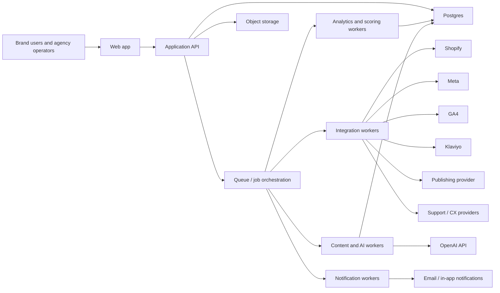
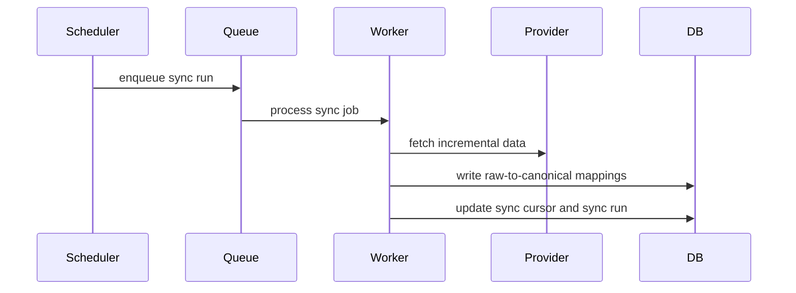
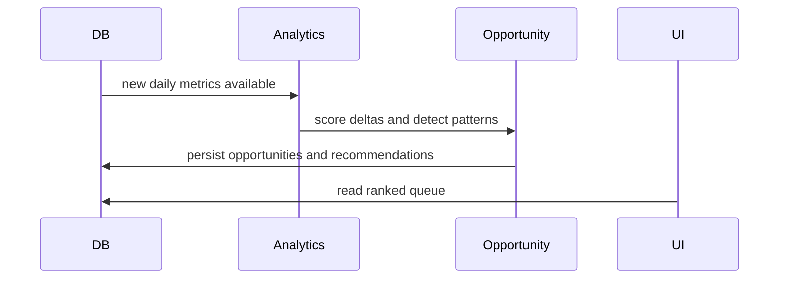
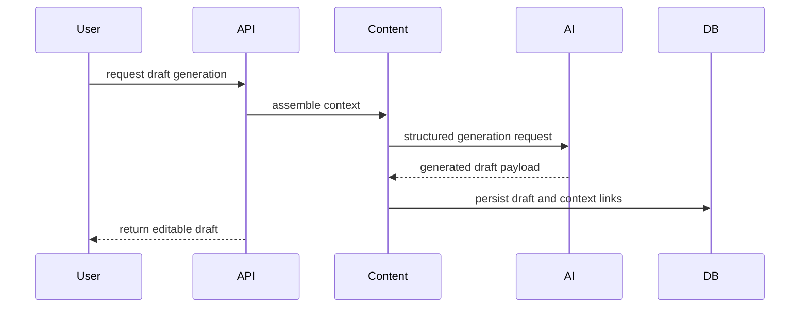
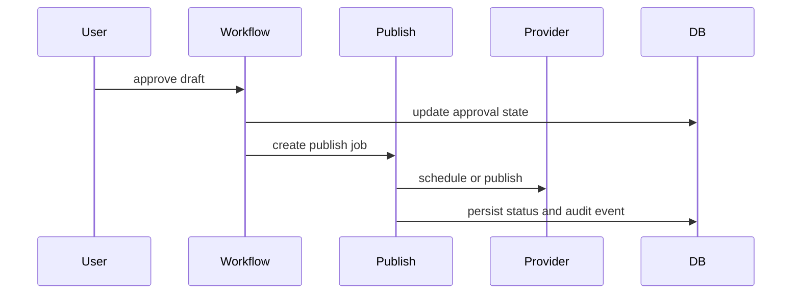

# Structural Architecture
## Agency
### System structure for the full D2C growth operating system

## 1. Purpose
This document defines the logical and runtime architecture for `agency`.

It is intended to answer:
- what the major system layers are
- how services are separated
- how data flows through the product
- where integrations, AI, workflows, and reporting belong

## 2. Architecture principles
- multi-tenant by design
- Shopify-first domain model
- approval-first execution model
- asynchronous ingestion and enrichment
- explainable AI over opaque generation
- modular domain services with shared data contracts
- one system of record for brand operations

## 3. System context

## 4. High-level layers
### Experience layer
The web app provides:
- public marketing pages
- authentication
- authenticated workspace UI
- review and publishing workflows

### Application layer
The API layer provides:
- auth and workspace access
- CRUD endpoints
- orchestration entry points
- role and policy enforcement
- query composition for UI views

### Domain services layer
The domain services provide:
- integration sync management
- analytics and scoring
- content generation
- trend and competitor intelligence
- approvals and publishing
- retention and CX intelligence
- reporting and notifications

### Data layer
The data platform provides:
- Postgres as the canonical system of record
- Redis-backed queue state
- object storage for exports and attachments
- event and audit persistence

## 5. Logical service map
### Web app
Owns:
- page rendering
- server actions and route handlers
- UI composition
- authenticated navigation

### Auth and workspace service
Owns:
- user identity
- brand workspaces
- role assignments
- invite flows
- approval permissions

### Integration service
Owns:
- OAuth or credential management
- sync scheduling
- cursor tracking
- provider-specific mapping into canonical models

### Analytics service
Owns:
- daily and period metrics
- anomaly detection
- product scoring
- channel and campaign summaries
- opportunity creation from performance signals

### Market intelligence service
Owns:
- trend ingestion
- trend scoring
- competitor observations
- recommended trend responses

### Content intelligence service
Owns:
- prompt input assembly
- hook, caption, script, and brief generation
- draft versioning
- content plans and calendar outputs

### Workflow service
Owns:
- approvals
- comments
- change requests
- assignment
- state transitions

### Publishing service
Owns:
- publish jobs
- provider delivery
- retries and failures
- publish audit log

### Retention and CX service
Owns:
- retention scoring
- cohort and lifecycle insight generation
- delivery and returns issue summaries
- support issue clustering

### Reporting and notifications service
Owns:
- weekly brief composition
- report exports
- inbox delivery
- alert routing
- scheduled notifications

## 6. Core runtime components
### `Next.js` app
Hosts:
- public pages
- authenticated UI
- route handlers
- server-side queries

### `Postgres`
Stores:
- workspaces and users
- canonical commerce and marketing data
- opportunities and recommendations
- drafts, approvals, publish jobs
- reports, inbox items, and audit logs

### Queue and workers
Use:
- `BullMQ` first
- path to `Temporal` later if workflow complexity demands it

Workers execute:
- sync jobs
- analytics recomputation
- trend ingestion
- content generation
- report generation
- notifications
- publishing

### AI gateway
Wraps:
- prompt assembly
- structured output validation
- retry and fallback handling
- logging and evaluation hooks

## 7. Primary data flows
### Ingestion flow

### Opportunity flow

### Content generation flow

### Approval and publishing flow

## 8. Deployment topology
### App tier
- `Vercel` or equivalent for the web app

### Data tier
- managed `Postgres`
- managed `Redis`
- object storage for exports and assets

### Worker tier
- long-running background workers for queues
- isolated from the UI runtime

## 9. Security and tenancy
- tenant isolation at the brand workspace level
- role-based access control on sensitive actions
- encrypted secrets for external integrations
- audit logs for approvals, publishing, and automation changes
- least-privilege access for provider tokens

## 10. Observability
The system should emit:
- sync run logs
- job run logs
- AI generation logs
- approval and publish events
- error tracing
- queue health and latency metrics

## 11. Resilience expectations
- ingestion jobs retry safely
- provider outages degrade gracefully
- stale data is surfaced in the UI
- failed publish jobs are recoverable
- AI failures do not corrupt source records

## 12. Relationship to the current scaffold
The current codebase implements only a thin shell of:
- landing
- login
- overview
- brief detail
- opportunities
- content
- approvals
- publishing
- integrations

This architecture document is for the full system those routes will eventually sit on top of.
