# Full App IA
## Agency
### Full information architecture for the D2C growth operating system

## 1. Purpose
This document expands `agency` from the MVP wedge into the full product vision implied by the research.

It is based on:
- [../research/market-research.md](../research/market-research.md)
- [../research/market-gaps-and-pain-points.md](../research/market-gaps-and-pain-points.md)
- [./PRD.md](./PRD.md)

This is the full app definition for a D2C growth operating system that solves fragmentation across:
- analytics
- reporting
- product intelligence
- content operations
- trends and competitors
- approvals and publishing
- retention
- customer experience
- support operations

## 2. Core use case
`Agency` is the operating layer for Shopify-first D2C brands with lean teams.

Instead of forcing a brand to move between analytics, trend tools, content tools, schedulers, reports, and approval systems, the app should give them one workspace that:
- reads store and channel data
- identifies what changed and why
- prioritizes what products, campaigns, and issues matter most
- translates findings into hooks, scripts, calendars, and actions
- routes work through review and approvals
- tracks execution and outcomes

## 3. Pain points the app must solve
### Brand and operator pain points
- rising CAC
- weak retention and repeat purchase
- too much content demand
- too many disconnected tools
- weak attribution confidence
- no time for dashboards
- slow trend response
- weak connection between content and revenue
- reporting fatigue
- margin pressure

### End-customer pain points the app should help operators address
- poor returns and delivery communication
- slow support response
- generic content
- low trust in inauthentic brands
- unclear value communication

## 4. Full feature map

```mermaid
flowchart TD
    A["Agency: Full D2C Growth OS"] --> B["Command Center"]
    A --> C["Commerce + Analytics"]
    A --> D["Content Studio"]
    A --> E["Trend + Competitor Intel"]
    A --> F["Workflow + Publishing"]
    A --> G["Retention + CRM Intelligence"]
    A --> H["CX + Support Ops"]
    A --> I["Reporting + Collaboration"]
    A --> J["Brand Memory + Admin"]
    A --> K["Integrations + Data Layer"]

    B --> B1["overview"]
    B --> B2["alerts"]
    B --> B3["weekly briefs"]

    C --> C1["store metrics"]
    C --> C2["products"]
    C --> C3["channels"]
    C --> C4["campaigns"]
    C --> C5["opportunities"]

    D --> D1["hooks"]
    D --> D2["captions + scripts"]
    D --> D3["creator briefs"]
    D --> D4["calendar"]
    D --> D5["draft editor"]

    E --> E1["trends"]
    E --> E2["trend-to-brand-fit"]
    E --> E3["competitors"]
    E --> E4["response recommendations"]

    F --> F1["approvals"]
    F --> F2["publishing"]
    F --> F3["audit trail"]
    F --> F4["automation controls"]

    G --> G1["repeat purchase"]
    G --> G2["retention risks"]
    G --> G3["lifecycle recommendations"]

    H --> H1["returns + delivery issues"]
    H --> H2["support response gaps"]
    H --> H3["CX communications"]

    I --> I1["founder reports"]
    I --> I2["team updates"]
    I --> I3["notifications + inbox"]

    J --> J1["brand profile"]
    J --> J2["brand voice"]
    J --> J3["users + permissions"]

    K --> K1["Shopify"]
    K --> K2["Meta"]
    K --> K3["GA4"]
    K --> K4["Klaviyo"]
    K --> K5["social publishing"]
```


## 5. Sidebar structure
### Main navigation
- Overview
- Alerts
- Weekly Briefs

### Commerce intelligence
- Products
- Channels
- Campaigns
- Opportunities

### Content operations
- Content Studio
- Content Calendar
- Drafts

### Market intelligence
- Trends
- Competitors

### Workflow and execution
- Approvals
- Publishing
- Inbox

### Growth operations
- Retention
- CX Ops
- Support Ops
- Reports

### Settings and admin
- Integrations
- Brand Memory
- Users and Permissions
- Automations

## 6. Full page inventory
The full product should include 27 core pages: 2 public pages and 25 authenticated app pages.

### Public pages
1. `/`
Landing page that explains the product, value proposition, and demo entry.

2. `/login`
Authentication, invite acceptance, and workspace access.

### Authenticated workspace pages
3. `/brands/[brandId]/overview`
Unified command center for the workspace.

4. `/brands/[brandId]/alerts`
Always-on alerts and operational exceptions.

5. `/brands/[brandId]/briefs`
List of weekly and historical business briefs.

6. `/brands/[brandId]/briefs/[briefId]`
Detailed founder-ready weekly brief.

7. `/brands/[brandId]/products`
Product intelligence list and ranking.

8. `/brands/[brandId]/products/[productId]`
Deep product detail page with performance, messaging, and actions.

9. `/brands/[brandId]/channels`
Channel-level performance and contribution analysis.

10. `/brands/[brandId]/campaigns`
Campaign monitoring and campaign-linked opportunities.

11. `/brands/[brandId]/opportunities`
Ranked queue of product, channel, trend, and CX opportunities.

12. `/brands/[brandId]/trends`
Trend detection, brand-fit scoring, and urgency assessment.

13. `/brands/[brandId]/competitors`
Competitor monitoring and response recommendations.

14. `/brands/[brandId]/content`
Content studio home for hook, caption, and script generation.

15. `/brands/[brandId]/content/calendar`
Weekly and monthly content planning calendar.

16. `/brands/[brandId]/content/drafts/[draftId]`
Draft editor and review detail page.

17. `/brands/[brandId]/approvals`
Approval queue for briefs, drafts, and publish actions.

18. `/brands/[brandId]/publishing`
Scheduling, publish jobs, and outcome tracking.

19. `/brands/[brandId]/retention`
Repeat purchase, lifecycle, and retention intelligence.

20. `/brands/[brandId]/cx`
Customer experience operations for delivery, returns, and messaging gaps.

21. `/brands/[brandId]/support-ops`
Support-response monitoring, issue clustering, and escalation visibility.

22. `/brands/[brandId]/reports`
Exportable reports and cross-functional summaries.

23. `/brands/[brandId]/inbox`
Notifications, approvals, alerts, and account-manager style updates.

24. `/brands/[brandId]/settings/integrations`
Connection health and sync controls for external systems.

25. `/brands/[brandId]/settings/brand-memory`
Brand profile, brand voice, messaging rules, and customer context.

26. `/brands/[brandId]/settings/users`
Users, roles, permissions, and invite management.

27. `/brands/[brandId]/settings/automations`
Automation guardrails, thresholds, approval policies, and optional autopublishing rules.

## 7. Page-by-page purpose and widgets
### 1. Landing
Purpose:
Introduce the product and move users into login or demo.

Core widgets:
- hero section
- positioning statement
- problem/solution strip
- product loop visual
- CTA buttons

### 2. Login
Purpose:
Authenticate users and route them into the right brand workspace.

Core widgets:
- sign-in form
- invite acceptance
- workspace selection
- role-aware redirect

### 3. Overview
Purpose:
Give the team a single-screen understanding of current business state.

Core widgets:
- KPI row for revenue, AOV, conversion, repeat purchase
- top wins
- top risks
- active alerts
- top products
- urgent recommendations
- pending approvals
- sync health

### 4. Alerts
Purpose:
Show real-time or recent exceptions that need action.

Core widgets:
- alert feed
- severity filters
- alert source badges
- linked entity cards
- assign or dismiss actions

### 5. Briefs list
Purpose:
Let users browse weekly and archived briefs.

Core widgets:
- brief list
- search and date filters
- delivery status
- summary snippets

### 6. Brief detail
Purpose:
Explain what changed, why it changed, and what should happen next.

Core widgets:
- executive summary
- top wins
- top risks
- drivers of change
- recommended actions
- linked opportunities
- linked content suggestions
- comments or notes

### 7. Products
Purpose:
Rank and monitor the product catalog by business importance and change.

Core widgets:
- product table
- movement ranking
- conversion and revenue deltas
- margin flags
- content support flags
- merchandising suggestions

### 8. Product detail
Purpose:
Create one product-specific operating page.

Core widgets:
- revenue trend
- conversion trend
- add-to-cart and PDP health
- traffic sources
- return rate
- messaging opportunities
- recommended hooks
- recommended content formats

### 9. Channels
Purpose:
Give channel-level visibility across paid, organic, direct, and owned sources.

Core widgets:
- channel performance table
- spend versus revenue panels
- session quality view
- conversion quality view
- channel opportunity summary

### 10. Campaigns
Purpose:
Track campaigns and connect them to outcomes and content needs.

Core widgets:
- campaign list
- status and objective filters
- campaign performance cards
- creative fatigue signals
- linked opportunities

### 11. Opportunities
Purpose:
Central queue of growth opportunities and risks across the workspace.

Core widgets:
- ranked opportunity list
- impact score
- confidence score
- evidence drawer
- status filters
- generate content action
- accept, dismiss, or escalate actions

### 12. Trends
Purpose:
Turn trend detection into brand-relevant execution.

Core widgets:
- trend feed
- fit score
- urgency score
- saturation note
- recommended product match
- recommended format
- recommended angle

### 13. Competitors
Purpose:
Monitor competitor launches, offers, content styles, and messaging shifts.

Core widgets:
- competitor list
- recent observations
- offer and promo tracker
- messaging shift cards
- response recommendations

### 14. Content Studio
Purpose:
Generate performance-linked content assets and campaign ideas.

Core widgets:
- source context panel
- hook generator
- caption generator
- script generator
- creator brief generator
- format selector
- channel selector

### 15. Content Calendar
Purpose:
Plan content by week, campaign, channel, and product priority.

Core widgets:
- weekly calendar
- monthly calendar
- draft placement
- campaign overlays
- status filters
- publish readiness

### 16. Draft detail
Purpose:
Edit, compare, review, and finalize one content draft.

Core widgets:
- draft editor
- version history
- linked product and trend context
- brand voice guardrails
- feedback thread
- send to approval

### 17. Approvals
Purpose:
Provide the trust layer between generation and execution.

Core widgets:
- pending queue
- assignee filters
- preview panel
- approve action
- request changes action
- reject action
- audit history

### 18. Publishing
Purpose:
Control scheduling, publishing, retries, and outcome tracking.

Core widgets:
- publish queue
- scheduled posts
- job status table
- provider details
- retry controls
- delivery log

### 19. Retention
Purpose:
Help operators respond to weak repeat purchase and lifecycle gaps.

Core widgets:
- repeat purchase KPI
- cohort summary
- replenishment opportunities
- win-back opportunities
- cross-sell suggestions
- lifecycle recommendations

### 20. CX Ops
Purpose:
Surface delivery, returns, and customer experience issues that hurt brand trust and margin.

Core widgets:
- returns trends
- return reason breakdown
- delivery issue summary
- shipping delay alerts
- CX communication recommendations

### 21. Support Ops
Purpose:
Give teams visibility into slow response and recurring customer pain.

Core widgets:
- response time summary
- issue cluster list
- escalation queue
- recurring complaint patterns
- suggested response templates

### 22. Reports
Purpose:
Support exports and role-specific reporting views.

Core widgets:
- founder report export
- marketer report export
- content performance summary
- CX summary
- weekly recap packages

### 23. Inbox
Purpose:
Centralize alerts, approvals, notifications, and account-manager updates.

Core widgets:
- unread queue
- alert cards
- approval requests
- weekly brief delivery
- action reminders

### 24. Integrations
Purpose:
Manage the external systems that power the workspace.

Core widgets:
- provider cards
- connection status
- last sync time
- sync health
- reconnect controls
- manual sync actions

### 25. Brand Memory
Purpose:
Preserve brand context so outputs stay specific and brand-safe.

Core widgets:
- positioning form
- brand voice rules
- do and do not say lists
- target customer notes
- hero product list
- messaging examples

### 26. Users and permissions
Purpose:
Control who can see, edit, approve, and publish.

Core widgets:
- user list
- role matrix
- invite form
- access controls
- approval permissions

### 27. Automations
Purpose:
Set safety rules for automation and escalation.

Core widgets:
- automation toggles
- approval thresholds
- autopublish guardrails
- alert routing rules
- safe mode controls

## 8. Research-to-feature mapping
| Research pain point | App capability |
|---|---|
| Too many disconnected tools | overview, inbox, integrations, unified workspace |
| No time for dashboards | overview, briefs, alerts, reports |
| Reporting fatigue | founder briefs, role-specific reports, inbox delivery |
| Weak attribution confidence | channels, campaigns, product detail, analytics models |
| Weak connection between content and revenue | opportunities, products, content studio, calendar |
| Too much content demand | content studio, draft editor, creator briefs, calendar |
| Slow trend response | trends, alerts, opportunities, content studio |
| Trend overload | trend scoring, fit and urgency scoring, competitor context |
| Rising CAC and margin pressure | channels, campaigns, products, alerts, CX ops |
| Weak retention | retention page, lifecycle recommendations, reports |
| Poor returns and delivery experience | CX ops, alerts, reports |
| Slow support response | support ops, inbox, alerts |
| Generic content | brand memory, content studio, product detail, trends |
| Low trust in AI | approvals, audit trail, brand memory, automations |

## 9. Role-based user journeys
### Founder or CEO journey
1. Log in and land on Overview.
2. Read the latest Weekly Brief.
3. Review top wins, risks, and urgent alerts.
4. Approve or comment on important content or publishing requests.
5. Check Reports for founder-ready exports.

What they get:
- fast clarity
- concise risk and opportunity visibility
- minimal dashboard digging

### Growth marketer journey
1. Open Overview and Alerts.
2. Review Opportunities, Channels, and Campaigns.
3. Open Trends and Competitors for context.
4. Use Content Studio to generate hooks and campaign assets.
5. Send drafts to Approvals and track Publishing.

What they get:
- faster decisions
- clearer product and channel priorities
- content linked to revenue

### Content or social lead journey
1. Review Opportunities and Trends.
2. Create drafts in Content Studio.
3. Place approved drafts into the Content Calendar.
4. Submit work through Approvals.
5. Use Publishing to schedule and monitor delivery.

What they get:
- higher output volume
- better context for content choices
- safer publishing workflow

### E-commerce manager journey
1. Use Products, Channels, and Alerts to monitor business health.
2. Open Product detail pages to investigate weak PDPs or rising SKUs.
3. Review Retention and CX Ops for customer and margin issues.
4. Coordinate with content and growth on the actions that matter most.

What they get:
- product-level clarity
- merchandising and PDP insight
- visibility into returns, delivery, and retention issues

## 10. Full product loop
```text
Integrations -> Overview -> Alerts/Briefs -> Products/Channels/Opportunities ->
Trends/Competitors -> Content Studio -> Approvals -> Publishing ->
Retention/CX/Support feedback -> Reports/Inbox -> repeat
```

## 11. Relationship to the current scaffold
The current app scaffold only covers a narrow first slice:
- landing
- login
- overview
- brief detail
- opportunities
- content
- approvals
- publishing
- integrations

That is a subset of this full information architecture, not the full product definition.
